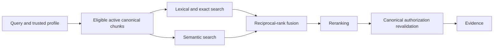

# Retrieval pipeline

Employee search and the assistant call the same `RetrievalService`:

Authorization runs before either candidate retriever. The live semantic adapter uses a server-selected tenant namespace and mandatory organization, publication, and eligible-chunk filters. Lexical search receives only the same eligible canonical chunk set. A final canonical check rejects stale or unauthorized results before evidence leaves the service.

Pinecone is derived. A version becomes publishable only after all approved canonical sources are chunked, embedded, staged, and verified. The current embedding, chunking, fusion weights, and reranker are fixtures and remain configurable pending real-SOP evaluation.

System administrators can inspect tenant-scoped retrieval traces with employee scope, candidate channels, fusion order, reranked order, selected context, provider names, and latency. Employee responses omit similarity scores and retrieval internals.
