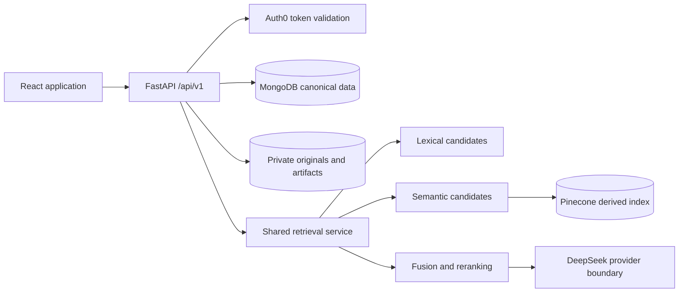

# System architecture

The system separates authoritative records from derived services. MongoDB stores organization-owned application records and reviewed canonical SOPs. Private S3-compatible storage holds originals and immutable extraction artifacts. Pinecone holds rebuildable retrieval vectors. The LLM explains already-authorized canonical evidence and is never an authority for identity, access, publication, or policy content.

`organization_id` is required on every organization-owned contract and every Mongo/Pinecone operation. The backend obtains it from a validated Auth0 organization membership and authoritative employee profile. Request bodies cannot select a tenant.

Fixture mode uses deterministic local parsers, embeddings, reranking, an in-memory canonical adapter, and private local artifacts. Live mode hydrates a process-local unit of work from MongoDB and flushes successful mutations back to tenant-owned Mongo collections. Multi-instance change coordination still requires a production transaction/outbox implementation before deployment.

Search and canonical policy reading remain operational when the LLM is unavailable.
